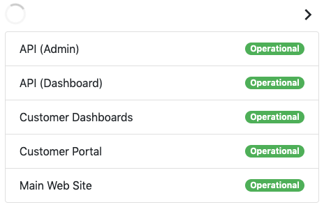

# Embeddable StatusDashboard Widget

The embeddable StatusDashboard widget allows you to embed status information from the StatusDashboard dashboard API directly onto your own web pages.

## Installation ##
The StatusDashboard widget is composed of the following files:

| File | Description |
| - | - |
| js/sd-widget.js | Widget JavaScript |
| js/sd-widget.css | Widget Style Sheets |
| html/sd-widget-bs.html | Example web page |

The widget is currently built for sites utilizing Bootstrap 4.  Future versions of the widget will provide for a more generic installation environment.  To integrate the widget into your site, perform the following:

1. Add sd-widget.js and sd-widget.css to your website's static assets location or CDN and ensure they are accessible from your web site.
2. On the web page where the widget will load, include **sd-widget.css** in the head and **sd-widget.js** as close to the bottom of the webpage as possible.
3. Include the following required HTML elements/classes in your web page:

| Element/Class Name | Purpose |
| - | - |
| div.sd-spinner | When the widget is acquiring data from the API, a loading spinner will display. |
| a#sd-previous | Previous navigation icon, used when there are multiple pages of services. |
| a#sd-next | Next navigation icon, used when there are multiple pages of services. |
| div#status-container | The element that will contain the widget. | 
4. Set JavaScript configuration variables (below).

## Configuration ##

### StatusDashboard Configuration ###
In order for the StatusDashboard widget to acquire status information, the dashboard API must be enabled on your StatusDashboard account.  To enable the dashboard API, login to your [StatusDashboard account](https://www.statusdashboard.com/admin) and navigate to **Status Dashbords > Edit > Options Dropdown > API**

Note: If you have a dashboard whitelist enabled for the dashboard, ensure that the IP addresses from which the widget will be accessed are allowed. 

### Widget Configuration ###
Configuration variables are located at the top of sd-widget.js.  These variables control the basic look and feel of the StatusDashboard widget.  The only variable that must be set is the domain, which must be set to your StatusDashboard subdomain (e.g. https://acme.statusdashboard.com) or your StatusDashboard domain alias (e.g. https://status.acme.com).

| Variable  | Default Value | Purpose |
| - | - | - |
| domain |  | The statusdashboard subdomain or domain alias Url. |
| color_operational | #4CAF50 | The color to apply to operational services. |
| status_operational | Operational | The text used to describe operational services. |
| color_incident | #F44336 | The color to apply to services experiencing an incident. |
| status_incident | Incident | The text used to describe services experiencing an incident. |
| color_maintenance | #2196F3 | The color to apply to services that are part of scheduled maintenance. |
| status_maintenance | Maintenance | The text used to describe services that are part of scheduled maintenance. |
| color_both | #FFA500 | The color to apply to services that are experiencing an incident and are also part of scheduled maintenance. |
| status_both | Incident & Maintenance | The text used to describe services that are experiencing an incident and are also part of scheduled maintenance. |
| records | 5 | The number of records to include on each page of the widget. |
| debug | false | Enable debugging information to the JavaScript console for troubleshooting the widget. |
